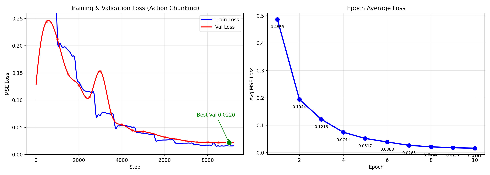

# Qwen3-VL + Regression Head VLA 模型

> 基于 Qwen3-VL-Embedding-8B 的 VLA（Vision-Language-Action）模型，输出连续 7 维机械臂动作。  
> 数据集：RoboMIND 2.0 Franka（国产）
> 
> **迭代一（单步回归）**：中位数欧氏距离误差 **5.9cm**  
> **迭代二（动作分块 + 时序平滑）**：中位数欧氏距离误差 **3.4cm ↓42%**，10 轮无过拟合

---

## 1. 架构总览

```
多帧图像 (4帧) + 任务指令
        │
        ▼
┌─────────────────────────────┐
│  Qwen3-VL-Embedding-8B     │
│  ┌───────────────────────┐  │
│  │ Visual Encoder (冻结) │  │
│  └───────────────────────┘  │
│  ┌───────────────────────┐  │
│  │ LLM (LoRA rank=16)   │  │
│  └───────────────────────┘  │
│  last_hidden_state → 4096   │
└─────────────────────────────┘
        │
        ▼
┌─────────────────────────────┐
│  MLP Regression Head       │
│  4096 → 2048 → 1024 → 70  │   ← 10步动作分块 × 7维
│  → reshape (B, 10, 7)     │
└─────────────────────────────┘
        │
    第1步执行 → 下一帧重新预测（Receding Horizon）
```

### 关键技术决策

| 决策 | 选择 | 原因 |
|------|------|------|
| 基座模型 | Qwen3-VL-Embedding-8B | 去 LM Head，省显存，匹配回归 |
| 动作输出 | 连续回归（MSE） | 避免离散 token 化的模式坍缩 |
| 时序建模 | 4 帧输入 | 模型看到运动趋势 |
| 动作分块 | 一次性预测 10 步 | 缓解误差累积，提升轨迹平滑度（迭代二） |
| 时序平滑 Loss | λ=0.01 惩罚相邻步突变 | 提升动作连续性（迭代二） |
| 微调方式 | LoRA rank=16 + 4-bit | 16GB 能跑 8B |
| 回归头 | 全量训练 | 从零学习动作空间 |

---

## 2. 数据集

**RoboMIND 2.0 Franka**（北京人形机器人创新中心 + 北京大学，ModelScope 托管）

| 属性 | 值 |
|---|---|
| 机器人 | Franka Emika Panda（7-DoF 单臂） |
| 数据格式 | HDF5（JPEG + 动作） |
| 国内源 | ✅ ModelScope 直链 |
| 训练/验证 | 7365 / 819 样本（动作分块后） |

**三组任务：**
1. **抓取放置**（move_apple_from_plate_to_bowl）：502 条
2. **抽屉开关**（close_drawer_with_both_arms_simultaneously）：300 条
3. **推拨**（move_tape_to_another_basket）：975 条

```
数据集选型: BridgeData V2 → LET-Base-Dataset → RoboMIND 2.0 Franka ✅
```

---

## 3. 训练结果

### 3.1 迭代一：单步回归（Baseline）

| Epoch | 训练 Avg Loss | 最佳验证 Loss |
|-------|---------------|---------------|
| 1 | 0.2686 | 0.1600 |
| 2 | 0.1130 | 0.1001 |
| 3 | 0.0643 | 0.0588 |
| 4 | 0.0380 | **0.0450（早停）** |

**评估结果：** 均值 12.6cm / 中位数 5.9cm

### 3.2 迭代二：动作分块 + 时序平滑



| Epoch | 训练 Avg Loss | 最佳验证 Loss |
|-------|---------------|---------------|
| 1 | 0.3409 | 0.2445 |
| 2 | 0.1765 | 0.1483 |
| 3 | 0.1115 | 0.1058 |
| 4 | 0.0717 | 0.0767 |
| 5 | 0.0499 | 0.0444 |
| 6 | 0.0365 | 0.0379 |
| 7 | 0.0269 | 0.0320 |
| 8 | 0.0209 | 0.0251 |
| 9 | 0.0173 | 0.0229 |
| 10 | **0.0160** | **0.0220（未拐头）** |

**10 轮训练无过拟合，val loss 持续下降。**

### 3.3 评估结果对比

| 指标 | 迭代一（单步） | 迭代二（动作分块） | 提升 |
|------|--------------|-------------------|------|
| 均值 EU | 12.6cm | **7.8cm** | ↓38% |
| 中位数 EU | 5.9cm | **3.4cm** | ↓42% |
| dx MAE | 0.49cm | **0.32cm** | -35% |
| dy MAE | 1.34cm | **0.71cm** | -47% |
| dz MAE | 1.25cm | **0.72cm** | -42% |
| droll MAE | 6.4° | **4.0°** | -37% |
| dpitch MAE | 0.8° | **0.6°** | -25% |
| dyaw MAE | 0.8° | **0.5°** | -38% |
| 夹爪准确率 | 99.89% | 99.88% | ≈持平 |

**动作分块 + 时序平滑全面优于单步回归，中位误差从 5.9cm 降至 3.4cm。**

### 3.4 训练配置

```yaml
batch_size: 1
gradient_accumulation_steps: 8
learning_rate: 1e-4
num_epochs: 10
action_horizon: 10
temporal_smooth_weight: 0.01
warmup_ratio: 0.1
mixed_precision: bf16
gradient_checkpointing: true
```

---

## 4. 仿真部署（进行中）

MuJoCo 闭环仿真框架已搭建完成：

```
VLA 模型推理 → 7维末端位姿增量
    → IK 求解器（关节角度）
    → MuJoCo 执行
    → 渲染截图 → 下一帧
```

**当前状态：**
- ✅ 模型推理 + IK + MuJoCo 闭环管道跑通
- ⚡ 待构建任务级仿真场景（物体放置、目标定义）
- ⚡ 待量化评估仿真成功率

---

## 5. 代码结构

```
VLM_Robotics/
├── src/
│   ├── model/
│   │   ├── qwen3vl_robot.py      # VLA 模型封装（含动作分块输出）
│   │   └── regression_head.py    # MLP 回归头
│   ├── data/
│   │   ├── dataset.py            # 多帧时序 + 动作分块标签
│   │   └── processing.py         # 动作归一化
│   └── train/
│       └── trainer.py            # Accelerate 训练 + CSV 日志
├── scripts/
│   ├── download_robomind.py      # 下载 RoboMIND 数据
│   ├── convert_robomind.py       # HDF5 → metadata
│   ├── train.py                  # 训练入口
│   ├── eval.py                   # 评估入口
│   ├── simulate.py               # MuJoCo 仿真
│   ├── plot_loss.py              # 画 Loss 曲线
│   └── run_train.sh              # 启动训练
├── configs/config.yaml
└── model-embedding/              # 8B 权重（私有，不上传 GitHub）
```

---

## 6. 运行指南

```bash
# 1. 环境
bash scripts/server_setup.sh

# 2. 数据下载
python scripts/download_robomind.py --max-episodes 100 --workers 3

# 3. 转换
python scripts/convert_robomind.py --data-dir data/raw/robomind --fps 5 --output data/processed/metadata.json

# 4. 训练
python scripts/train.py --config configs/config.yaml --metadata data/processed/metadata.json

# 5. 评估
python scripts/eval.py --checkpoint checkpoints/checkpoint-best --metadata data/processed/metadata.json --normalizer checkpoints/normalizer.json

# 6. 仿真
MUJOCO_GL=egl python scripts/simulate.py --checkpoint checkpoints/checkpoint-best --steps 100 --record trajectory.json
```

---

## 7. 后续方向

- **在线强化学习**：当前基于行为克隆（BC）依赖专家数据。下一步计划在 MuJoCo 仿真中引入 PPO 等在线 RL 算法，通过奖励信号让模型自我优化，提升对未知场景的泛化能力，降低对遥操作数据的依赖
- **仿真场景构建**：搭建任务级仿真场景（物体放置等），做闭环成功率评估
- **扩大数据量**：当前仅用 300 条/1,777 条可用轨迹
- **消融实验**：对比不同历史帧数的影响

---

## 8. 技术栈

| 层级 | 技术 |
|------|------|
| 语言 | Python 3.11 |
| 深度学习 | PyTorch 2.6, HuggingFace Transformers |
| 模型微调 | PEFT/LoRA, bitsandbytes 4-bit |
| 训练框架 | Accelerate（自定义循环） |
| 模型 | Qwen3-VL-Embedding-8B |
| 数据集 | RoboMIND 2.0 Franka（ModelScope） |
| 数据格式 | HDF5 |
| 仿真 | MuJoCo |
| 硬件 | NVIDIA RTX 4060 Ti 16GB |
